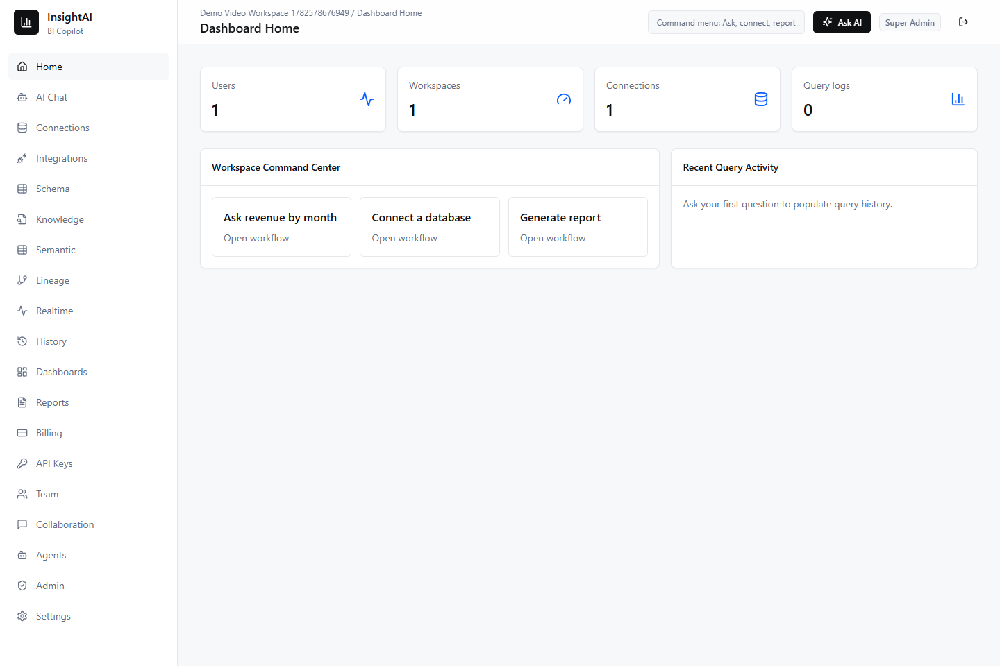
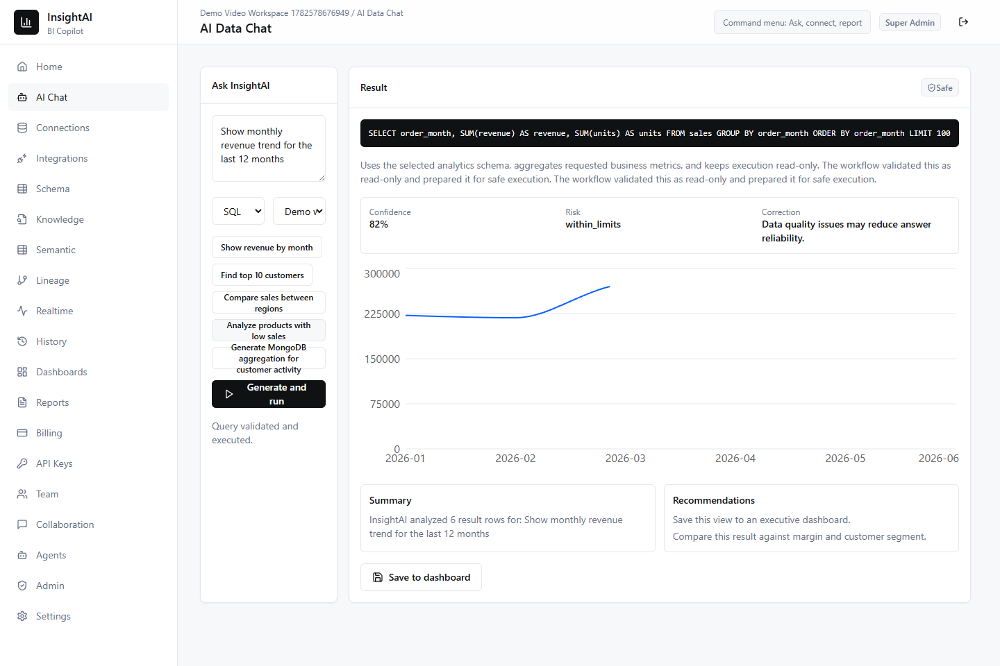
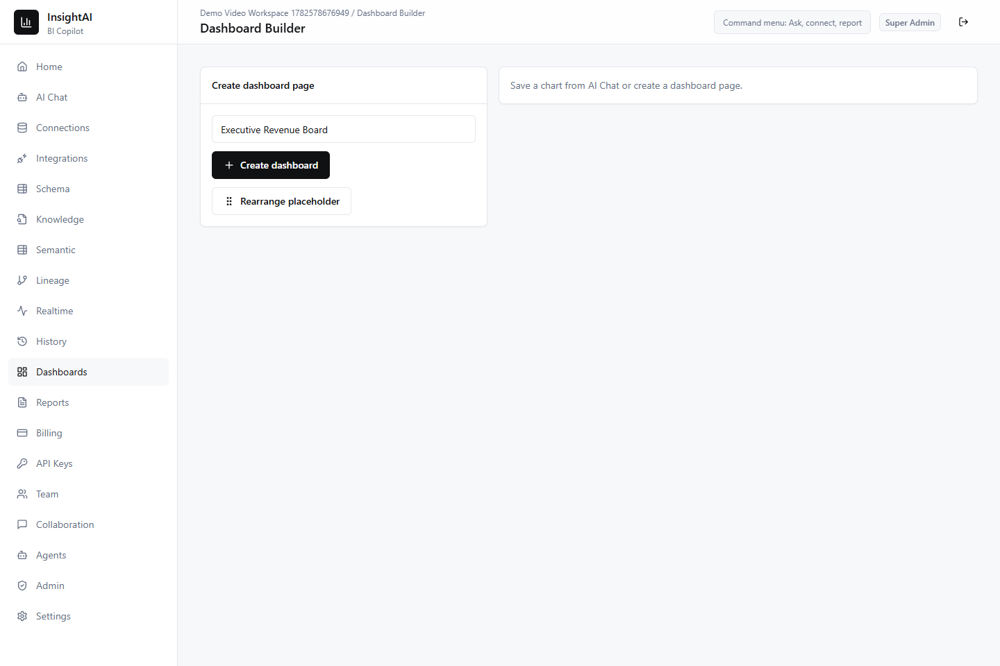
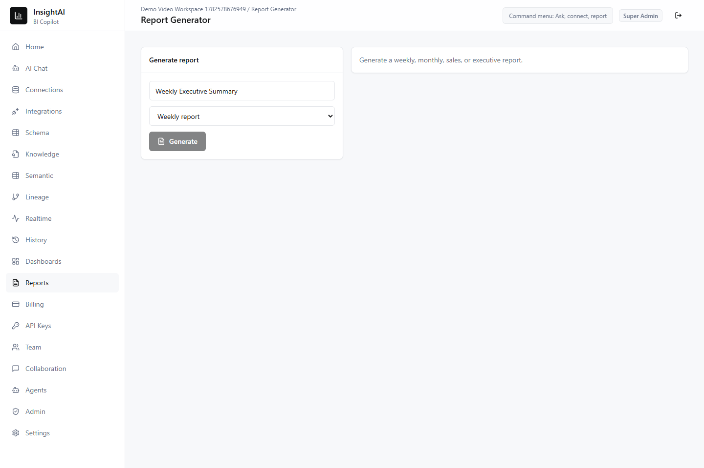
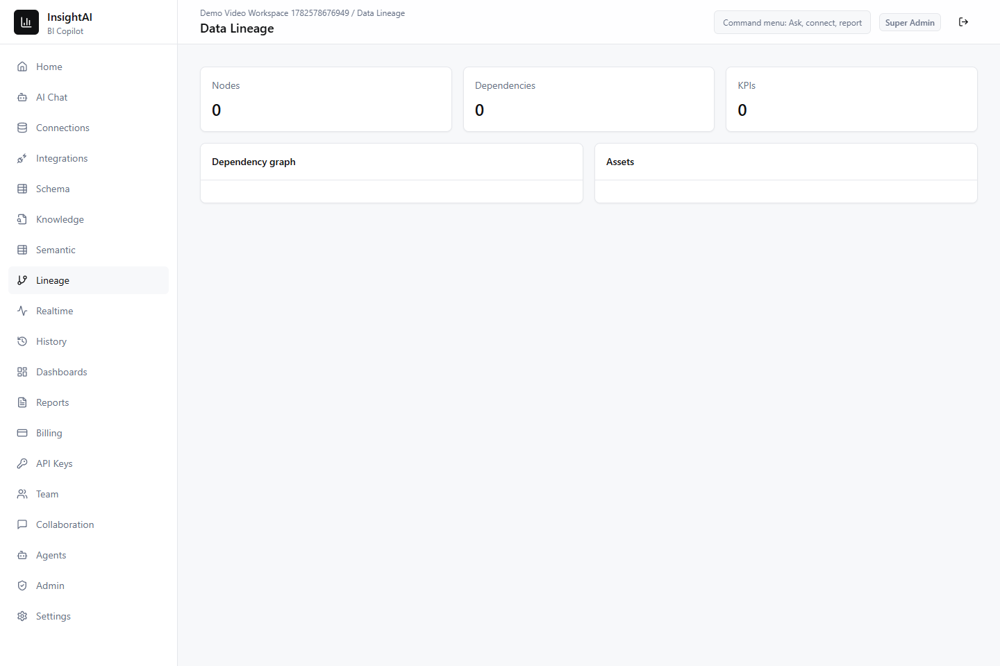
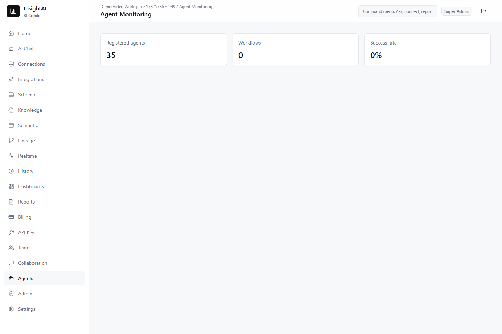
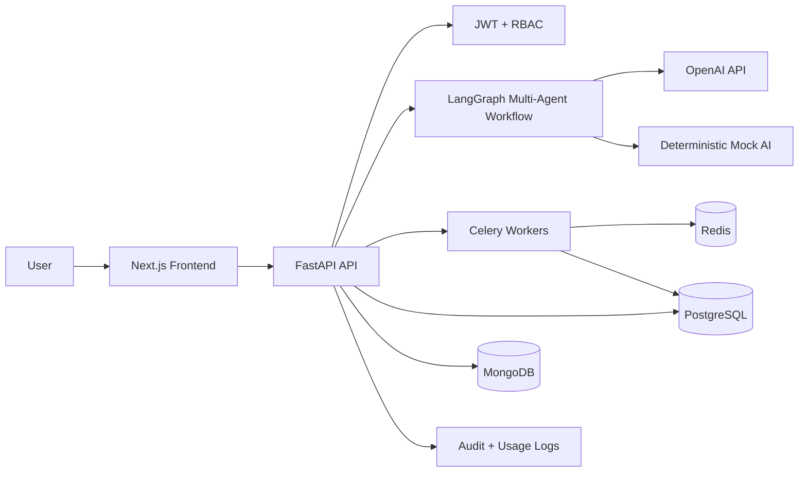

# InsightAI

AI-Powered Business Intelligence Copilot for modern teams.

InsightAI is a production-grade B2B SaaS application for connecting business data sources, asking questions in plain English, generating safe SQL or MongoDB queries, creating charts and dashboards, producing executive reports, and monitoring every AI and data operation with audit-grade traceability.

The repository is prepared as a public `v1.0.0` release with a Next.js frontend, FastAPI backend, LangGraph multi-agent workflow, PostgreSQL analytics store, MongoDB document store, Redis/Celery async jobs, Docker deployment assets, seed data, tests, screenshots, diagrams, and release documentation.

## Highlights

- Multi-tenant workspace model with workspace-scoped users, dashboards, reports, query history, data connections, saved prompts, settings, and audit logs.
- Role-based access control for Super Admin, Admin, Analyst, and Viewer roles.
- Safe natural-language analytics with schema intelligence, business glossary support, query confidence scoring, clarification flow, read-only SQL enforcement, MongoDB read aggregation validation, row limits, timeouts, and immutable audit logs.
- LangGraph architecture with supervisor, workflow planner, model router, RAG knowledge search, policy governance, monitoring and observability, query generation, validation, insight, visualization, report, ETL, anomaly, cost governance, and executive decision agents.
- Real business demo data for sales, customers, products, orders, employees, regions, expenses, and inventory.
- Demo mode with a seeded workspace, database connections, sample questions, dashboards, reports, and deterministic mock AI when `OPENAI_API_KEY` is not configured.
- Enterprise surfaces for data lineage, human approval, realtime KPI refresh, WebSocket updates, API connectors, CSV/Excel imports, report downloads, settings persistence, and agent monitoring.

## Screenshots

| Dashboard Home | AI Data Chat | Dashboard Builder |
| --- | --- | --- |
|  |  |  |

| Report Generator | Data Lineage | Agent Monitoring |
| --- | --- | --- |
|  |  |  |

## Demo

- Demo video: [docs/assets/demos/insightai-demo.webm](docs/assets/demos/insightai-demo.webm)
- Demo script: [docs/DEMO_VIDEO.md](docs/DEMO_VIDEO.md)
- Demo login:
  - Email: `admin@insightai.ai`
  - Password: `InsightAI123`

The walkthrough covers login, workspace creation, database connection, live synchronization, natural-language analytics, multi-agent execution, AI query generation, dashboard creation, executive reporting, data lineage, human approval, agent monitoring, audit logs, realtime KPI updates, report export, settings, and RBAC.

## Architecture



Detailed diagrams are in [diagrams/](diagrams/):

- [System architecture](diagrams/system-architecture.mmd)
- [LangGraph workflow](diagrams/langgraph-workflow.mmd)
- [Data lineage](diagrams/data-lineage.mmd)
- [Deployment topology](diagrams/deployment.mmd)

## Tech Stack

Frontend:

- Next.js 16 canary, React 19, TypeScript, Tailwind CSS
- shadcn-style component primitives, Recharts, Zustand, TanStack Query
- Playwright for E2E and demo capture

Backend:

- FastAPI, Python, SQLAlchemy, Pydantic, Alembic-ready structure
- JWT authentication, RBAC, audit logs, query logs, API metrics
- LangChain, LangGraph, OpenAI SDK with deterministic fallback

Data and jobs:

- PostgreSQL for structured analytics and relational application state
- MongoDB for chat history, dashboards, reports, preferences, knowledge documents, and agent traces
- Redis and Celery for long-running queries, report generation, imports, and scheduled jobs

Deployment:

- Docker Compose for local production-like stacks
- Production Dockerfiles for frontend and backend
- GitHub Actions CI for backend tests, frontend lint/test/build/audit/E2E
- Kubernetes, Nginx, and Terraform-ready deployment documentation

## Repository Structure

```text
.
|-- backend/              # FastAPI app, services, agents, models, tests
|-- frontend/             # Next.js app, components, stores, E2E tests
|-- data/                 # Demo business datasets and seed assets
|-- deploy/               # Kubernetes, Nginx, Terraform deployment assets
|-- docker/               # Docker release notes and compose guidance
|-- diagrams/             # Mermaid architecture and workflow diagrams
|-- docs/                 # Product, API, architecture, deployment, testing docs
|-- screenshots/          # Release screenshots captured from the live app
|-- tests/                # Release validation index
|-- .github/workflows/    # GitHub Actions CI
|-- docker-compose.yml    # Local production-like stack
`-- .env.example          # Safe environment template
```

## Quick Start

Prerequisites:

- Python 3.11 or 3.12
- Node.js 22
- Docker Desktop for the full stack
- Optional OpenAI API key

Clone and configure:

```powershell
git clone https://github.com/your-org/insightai.git
cd insightai
copy .env.example .env
```

Start the full stack:

```powershell
docker compose up --build
```

Open:

- Frontend: http://127.0.0.1:3000
- API docs: http://127.0.0.1:8000/docs
- Health: http://127.0.0.1:8000/health
- Agent monitoring: http://127.0.0.1:3000/admin/agents

## Local Development

Backend:

```powershell
cd backend
python -m venv .venv
.venv\Scripts\Activate.ps1
pip install -r requirements.txt
python -m uvicorn app.main:app --host 127.0.0.1 --port 8000
```

Frontend:

```powershell
cd frontend
npm.cmd install
npm.cmd run dev
```

On Windows PowerShell, prefer `npm.cmd` over the shell shim.

## Environment

Copy [.env.example](.env.example) to `.env` and configure values for your environment. `OPENAI_API_KEY` is optional. If it is missing, InsightAI uses deterministic mock AI while preserving the same API contract, safety checks, confidence output, monitoring, and UI flow.

Sensitive credentials are encrypted or masked in API responses and must never be committed. See [docs/SECURITY.md](docs/SECURITY.md).

## Testing

Backend:

```powershell
cd backend
python -m pytest
```

Frontend:

```powershell
cd frontend
npm.cmd run lint
npm.cmd run test
npm.cmd run build
npm.cmd audit --audit-level=moderate
npm.cmd run test:e2e
```

See [docs/TESTING.md](docs/TESTING.md) and [docs/reports/UPDATED_TESTING_REPORT.md](docs/reports/UPDATED_TESTING_REPORT.md) for the latest validation matrix.

## API Documentation

- Interactive OpenAPI docs: http://127.0.0.1:8000/docs
- Route overview: [docs/API.md](docs/API.md)
- Expanded route inventory: [docs/reports/API_ROUTES.md](docs/reports/API_ROUTES.md)

Core route groups include auth, users, workspaces, database connections, schema, AI query generation, query execution, dashboards, reports, enterprise ETL/API connectors, semantic layer, data lineage, approvals, notifications, realtime events, observability, audit logs, and admin analytics.

## Documentation

- [System architecture](docs/ARCHITECTURE.md)
- [LangGraph workflow](docs/LANGGRAPH_WORKFLOW.md)
- [Database schema](docs/DATABASE_SCHEMA.md)
- [API endpoints](docs/API.md)
- [RBAC matrix](docs/RBAC_MATRIX.md)
- [Deployment guide](docs/DEPLOYMENT.md)
- [Testing guide](docs/TESTING.md)
- [Performance guide](docs/PERFORMANCE.md)
- [Security guide](docs/SECURITY.md)
- [Demo video guide](docs/DEMO_VIDEO.md)
- [Release notes](docs/RELEASE_NOTES_v1.0.0.md)

## Roadmap

- Managed staging validation against production Redis, MongoDB, PostgreSQL, OpenAI, and SaaS OAuth providers.
- Live connectors for Snowflake, BigQuery, Redshift, SQL Server, Oracle, HubSpot, Salesforce, and Slack delivery.
- Production vector ingestion pipeline for RAG knowledge documents.
- Fine-grained data residency policies and approval workflows per customer environment.
- Billing-grade usage metering and tenant-level quota enforcement.

## Release Status

This repository is prepared for the initial public release `v1.0.0`. Before tagging:

1. Run the full validation commands listed above.
2. Confirm `.env` and local databases are not staged.
3. Review [docs/RELEASE_NOTES_v1.0.0.md](docs/RELEASE_NOTES_v1.0.0.md).
4. Create an annotated tag: `git tag -a v1.0.0 -m "InsightAI v1.0.0"`.

## License

MIT. See [LICENSE](LICENSE).
